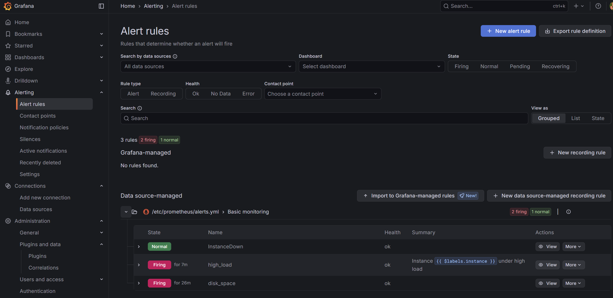
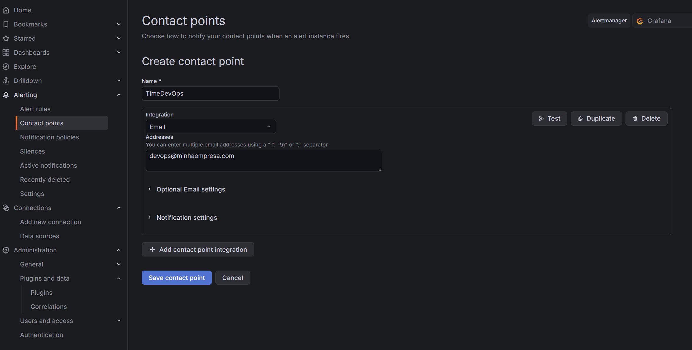
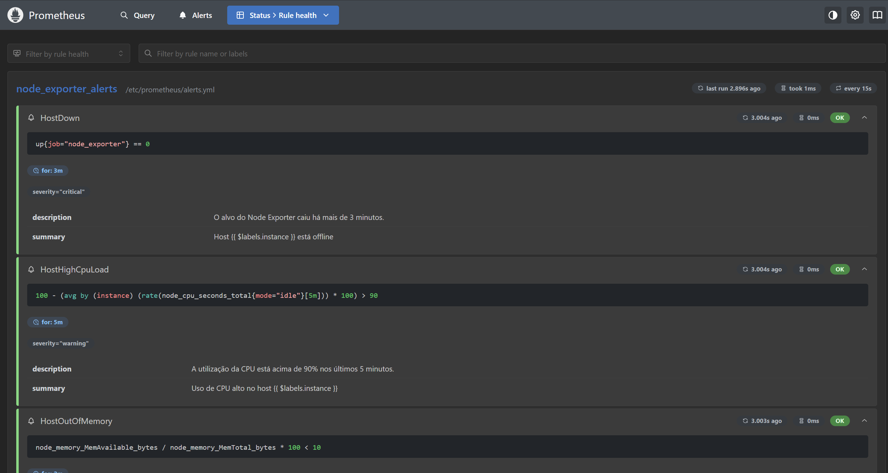
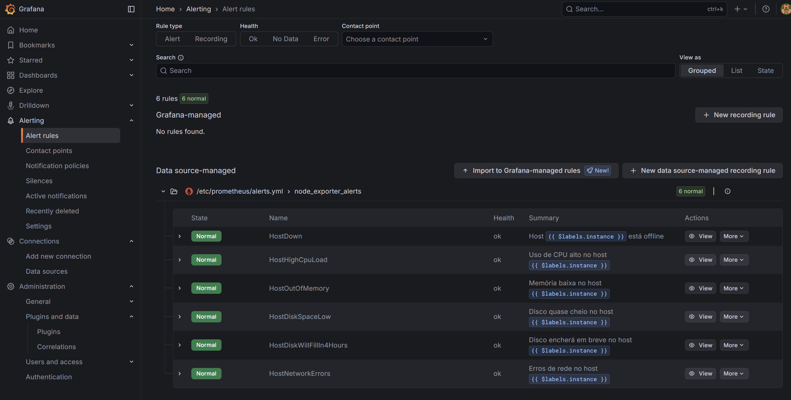
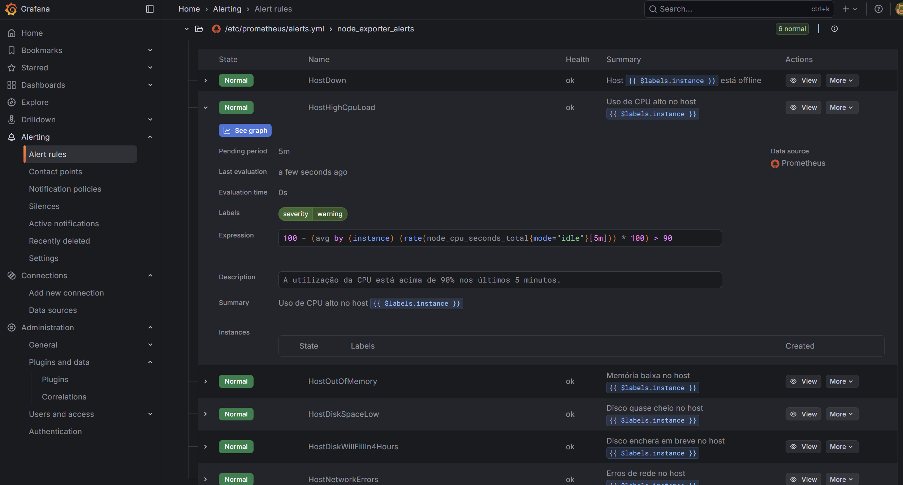
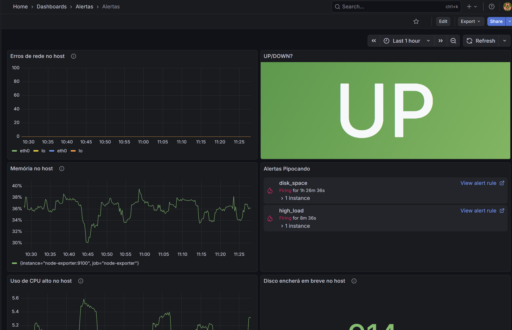
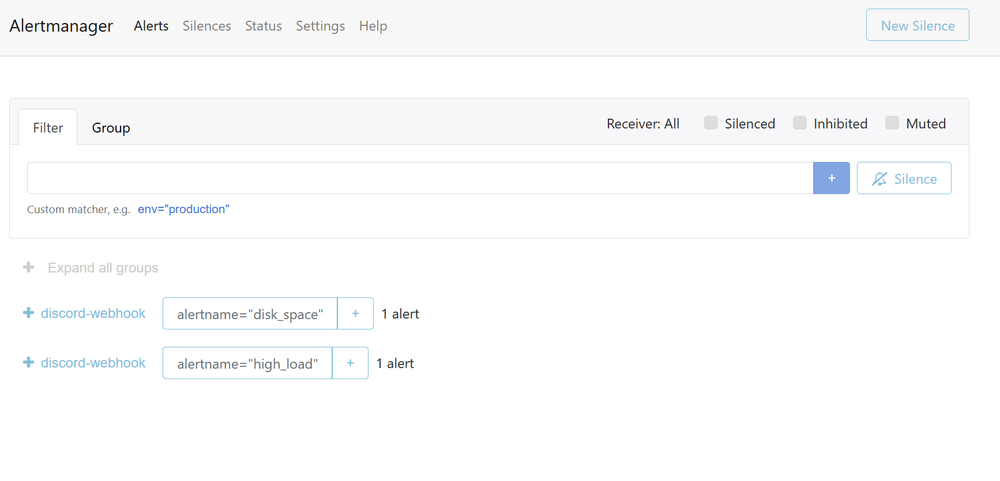
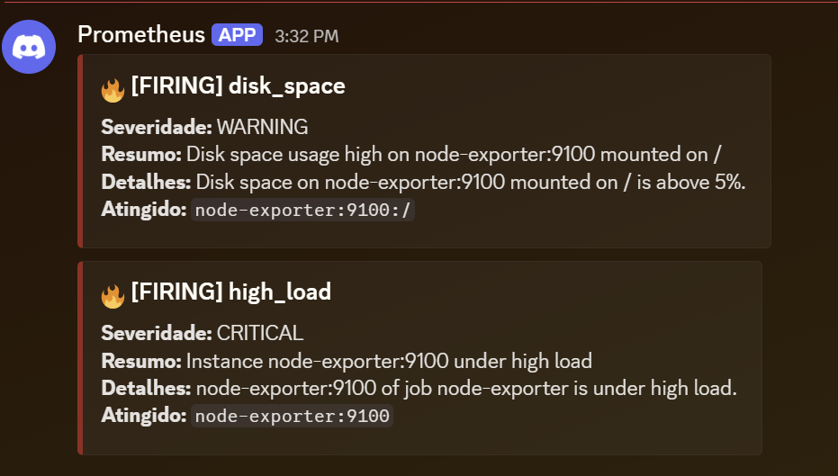

# Descomplicando o Prometheus

## DAY-5

### O que iremos ver hoje?

<details>
<summary class="summary">DAY-5</summary>

- [Descomplicando o Prometheus](#descomplicando-o-prometheus)
  - [DAY-5](#day-5)
    - [O que iremos ver hoje?](#o-que-iremos-ver-hoje)
    - [Configurando o prometheus para criar nosso primeiro alerta](#configurando-o-prometheus-para-criar-nosso-primeiro-alerta)
    - [Vendo os alertas no Grafana](#vendo-os-alertas-no-grafana)
    - [Configurando contact points o Grafana](#configurando-contact-points-o-grafana)
    - [Criando mais alertas no Prometheus](#criando-mais-alertas-no-prometheus)
      - [1. Disponibilidade da Instância](#1-disponibilidade-da-instância)
      - [2. CPU (Utilização e Saturação)](#2-cpu-utilização-e-saturação)
      - [3. Memória (Disponibilidade)](#3-memória-disponibilidade)
      - [4. Disco / Filesystem (Espaço e Previsão)](#4-disco--filesystem-espaço-e-previsão)
      - [5. Rede (Erros e Tráfego)](#5-rede-erros-e-tráfego)
      - [Depois de atualizar o arquivo de alertas](#depois-de-atualizar-o-arquivo-de-alertas)
    - [Criando Dashboads com os alertas do Prometheus](#criando-dashboads-com-os-alertas-do-prometheus)
    - [O que é o AlertManager](#o-que-é-o-alertmanager)
      - [1. Desduplicação (Deduplication)](#1-desduplicação-deduplication)
      - [2. Agrupamento (Grouping)](#2-agrupamento-grouping)
      - [3. Roteamento (Routing)](#3-roteamento-routing)
      - [4. Inibição (Inhibition)](#4-inibição-inhibition)
      - [Novo serviço no docker-compose](#novo-serviço-no-docker-compose)
      - [Exemplo visual de configuração (`alertmanager.yml`)](#exemplo-visual-de-configuração-alertmanageryml)
    - [Conhecendo um pouco mais sobre o AlertManager](#conhecendo-um-pouco-mais-sobre-o-alertmanager)
      - [Entendendo a configuração](#entendendo-a-configuração)
      - [Diferentes rotas e receivers](#diferentes-rotas-e-receivers)

</details>


### Configurando o prometheus para criar nosso primeiro alerta

Alerta para saber quantidade de bananas
```yaml
groups:
  - name: Meus primeiros alertas
    rules:
    - alert: AcabandoBanana
      expr: banana < 2
      annotations: 
        title: 'Acabando as bananas em casa {{ $labels.casa }}' 
        description: 'Urgente, temos somente {{ $value }} em {{ $labels.casa }}'
        value: {{ $value }}
      labels:
        severity: 'critical'
```

Ficando mais serio...

```yaml
groups:
- name: Basic monitoring
  rules:
  - alert: InstanceDown
    # Condition for alerting
    expr: up == 0
    for: 1m
    # Annotation - additional informational labels to store more information
    annotations:
      title: 'Instance {{ $labels.instance }} down'
      description: '{{ $labels.instance }} of job {{ $labels.job }} has been down for more than 1 minute.'
    # Labels - additional labels to be attached to the alert
    labels:
      severity: 'critical'
```

&nbsp;
&nbsp;

### Vendo os alertas no Grafana
Os alertas configurados no Prometheus ficam visiveis no Grafana!



&nbsp;
&nbsp;

### Configurando contact points o Grafana
Podemos configurar multiplos pontos de contato! e tambem colocar nao apenas um email, mas um grupo de email e configurar multitplos destinos alem do email (eg: teams, discod, jira, etc)




&nbsp;
&nbsp;

### Criando mais alertas no Prometheus

```yaml
groups:
- name: Basic monitoring
  rules:
  - alert: InstanceDown
    # Condition for alerting
    expr: up == 0
    for: 1m
    # Annotation - additional informational labels to store more information
    annotations:
      title: 'Instance {{ $labels.instance }} down'
      description: '{{ $labels.instance }} of job {{ $labels.job }} has been down for more than 1 minute.'
    # Labels - additional labels to be attached to the alert
    labels:
      severity: 'critical'
  - alert: high_load
    expr: node_load1 > 0.5
    annotations:
      description: '{{ $labels.instance }} of job {{ $labels.job }} is under high load.'
      summary: Instance {{ $labels.instance }} under high load
      value: '{{ $value }}'
  
  - alert: disk_space
    expr: (node_filesystem_size_bytes - node_filesystem_free_bytes) * 100 / node_filesystem_size_bytes > 5
    labels:
      instance: '{{ $labels.instance }}:{{ $labels.mountpoint }}'
    annotations:
      value: '{{ humanize $value }}%'
```

O `node_load1` é uma métrica coletada e exposta pelo Node Exporter;
Aqui está o que ela significa detalhadamente:
* **O que mede**: Representa a média de carga do sistema (Load Average) no último 1 minuto.
* O **"Load Average"** indica quantos processos estão usando a CPU ou aguardando para usar a CPU (ou aguardando I/O de disco) naquele momento.
* Existem também o node_load5 (média de 5 minutos) e node_load15 (média de 15 minutos).

```yaml
expr: node_load1 > 0.5
```

Isso significa que o alerta high_load será disparado se a média de carga de 1 minuto for maior que 0.5. O Prometheus está verificando a cada intervalo se o servidor está "ocupado demais" (carga acima de 0.5) neste exato momento (janela de 1 minuto). Se estiver, ele dispara o alerta.

Para criar alertas eficazes com o **Node Exporter**, é recomendável seguir o **Método USE** (Utilização, Saturação e Erros). Isso evita a "fadiga de alertas" e foca em sintomas reais que afetam o sistema.

Aqui estão as métricas essenciais divididas por recurso, com exemplos de consultas PromQL para seus alertas.

#### 1. Disponibilidade da Instância

O alerta mais básico e crítico. Indica se o Node Exporter (e consequentemente o servidor) está acessível.

* **Métrica:** `up`
* **Quando alertar:** Quando o valor for `0`.
* **Exemplo PromQL:**
```promql
up{job="node_exporter"} == 0

```


*(Dica: Configure um `for: 5m` para evitar alertas em reboots rápidos).*

---

#### 2. CPU (Utilização e Saturação)

Não olhe apenas para o uso total; o *Load Average* é vital para entender se há processos aguardando CPU (saturação).

* **Uso de CPU Elevado:**
* **Métrica:** `node_cpu_seconds_total`
* **Lógica:** Calcula a porcentagem de tempo que a CPU **não** está ociosa (idle).
* **Exemplo PromQL (Uso > 90%):**
```promql
100 - (avg by (instance) (rate(node_cpu_seconds_total{mode="idle"}[5m])) * 100) > 90

```

* **Load Average Alto:**
* **Métrica:** `node_load1` (ou `node_load5`, `node_load15`)
* **Lógica:** O Load deve ser comparado ao número de CPUs. Se o Load for maior que a contagem de núcleos, o sistema está saturado.
* **Exemplo PromQL:**
```promql
node_load1 > (count by (instance) (node_cpu_seconds_total{mode="idle"})) * 2

```


*(Alerta se o Load for o dobro do número de CPUs).*


---

#### 3. Memória (Disponibilidade)

O Linux usa memória livre para cache, então monitorar "memória livre" (`MemFree`) gera falsos positivos. O correto é monitorar a **memória disponível** (`MemAvailable`), que inclui a memória que pode ser reclamada de caches e buffers.

* **Métrica:** `node_memory_MemAvailable_bytes` e `node_memory_MemTotal_bytes`
* **Quando alertar:** Quando a memória disponível for menor que 10% do total.
* **Exemplo PromQL:**
```promql
(node_memory_MemAvailable_bytes / node_memory_MemTotal_bytes) * 100 < 10
```

---

#### 4. Disco / Filesystem (Espaço e Previsão)

Existem dois tipos de alertas aqui: "disco cheio agora" e "disco vai encher em breve".

* **Disco Cheio (%):**
* **Métrica:** `node_filesystem_avail_bytes`
* **Lógica:** Exclua sistemas de arquivos virtuais ou de leitura (como tmpfs).
* **Exemplo PromQL (Menos de 10% livre):**
```promql
(node_filesystem_avail_bytes{fstype!=""} / node_filesystem_size_bytes{fstype!=""} * 100) < 10

```

* **Previsão de Disco Cheio (4 horas):**
* **Lógica:** Usa a função `predict_linear` para projetar se o disco encherá nas próximas 4 horas com base na tendência da última hora.
* **Exemplo PromQL:**
```promql
predict_linear(node_filesystem_avail_bytes{fstype!=""}[1h], 4 * 3600) < 0

```

---

#### 5. Rede (Erros e Tráfego)

Geralmente não se alerta sobre *throughput* (banda) a menos que você tenha limites rígidos, mas **erros** são indicativos de falhas físicas ou de configuração.

* **Erros na Interface:**
* **Métrica:** `node_network_receive_errs_total` e `node_network_transmit_errs_total`
* **Exemplo PromQL (Aumento na taxa de erros):**
```promql
rate(node_network_receive_errs_total[5m]) > 0

```

**Resumo**

| Recurso | Métrica Chave | Objetivo do Alerta |
| --- | --- | --- |
| **Geral** | `up` | Servidor offline (Down) |
| **CPU** | `node_cpu_seconds_total` | CPU saturada (>90%) |
| **Memória** | `node_memory_MemAvailable_bytes` | Risco de OOM (Out of Memory) |
| **Disco** | `node_filesystem_avail_bytes` | Disco cheio ou prestes a encher |
| **System** | `node_time_seconds` | Drift de relógio (Time drift) |

Adicionamos labels de severidade (warning vs. critical) e annotations descritivas para que, quando o alerta chegar no Slack ou PagerDuty (via Alertmanager), você saiba exatamente o que está acontecendo.

```yaml
groups:
  - name: node_exporter_alerts
    rules:
      # 1. Instância Offline
      - alert: HostDown
        expr: up{job="node_exporter"} == 0
        for: 3m
        labels:
          severity: critical
        annotations:
          summary: "Host {{ $labels.instance }} está offline"
          description: "O alvo do Node Exporter caiu há mais de 3 minutos."

      # 2. CPU: Uso alto (> 90%)
      - alert: HostHighCpuLoad
        expr: 100 - (avg by(instance) (rate(node_cpu_seconds_total{mode="idle"}[5m])) * 100) > 90
        for: 5m
        labels:
          severity: warning
        annotations:
          summary: "Uso de CPU alto no host {{ $labels.instance }}"
          description: "A utilização da CPU está acima de 90% nos últimos 5 minutos."

      # 3. Memória: Menos de 10% disponível
      - alert: HostOutOfMemory
        expr: node_memory_MemAvailable_bytes / node_memory_MemTotal_bytes * 100 < 10
        for: 2m
        labels:
          severity: warning
        annotations:
          summary: "Memória baixa no host {{ $labels.instance }}"
          description: "O host tem menos de 10% de memória disponível."

      # 4. Disco: Menos de 10% de espaço livre
      # O filtro fstype exclui sistemas de arquivos virtuais para evitar falsos positivos
      - alert: HostDiskSpaceLow
        expr: (node_filesystem_avail_bytes{fstype!~"tmpfs|fuse.lxcfs|squashfs|vfat"} / node_filesystem_size_bytes{fstype!~"tmpfs|fuse.lxcfs|squashfs|vfat"} * 100) < 10
        for: 5m
        labels:
          severity: warning
        annotations:
          summary: "Disco quase cheio no host {{ $labels.instance }}"
          description: "O sistema de arquivos {{ $labels.mountpoint }} tem menos de 10% de espaço livre."

      # 5. Disco: Previsão de enchimento em 4 horas
      - alert: HostDiskWillFillIn4Hours
        expr: predict_linear(node_filesystem_avail_bytes{fstype!~"tmpfs|fuse.lxcfs|squashfs|vfat"}[1h], 4 * 3600) < 0
        for: 5m
        labels:
          severity: critical
        annotations:
          summary: "Disco encherá em breve no host {{ $labels.instance }}"
          description: "Baseado na tendência da última hora, o disco {{ $labels.mountpoint }} ficará sem espaço nas próximas 4 horas."

      # 6. Rede: Alta taxa de erros (Rx ou Tx)
      - alert: HostNetworkErrors
        expr: rate(node_network_receive_errs_total[5m]) > 0 or rate(node_network_transmit_errs_total[5m]) > 0
        for: 5m
        labels:
          severity: warning
        annotations:
          summary: "Erros de rede no host {{ $labels.instance }}"
          description: "Detectada taxa de erros na interface de rede nos últimos 5 minutos."
```

&nbsp;
&nbsp;

#### Depois de atualizar o arquivo de alertas
Aqui esta a nova pagina de alertas depois de aplicado a configuração de `files/alerts-completo.yaml`

```yaml
# docker-compose.yml

services:
  prometheus:
    image: prom/prometheus:latest
    container_name: prometheus
    ports:
      - "9090:9090"
    volumes:
      - ./prometheus.yml:/etc/prometheus/prometheus.yml
      - ./alerts.yml:/etc/prometheus/alerts.yml
      - ./alerts-completo.yaml:/etc/prometheus/alerts-completo.yaml # <----
      - prometheus_data:/prometheus
    command:
      - '--config.file=/etc/prometheus/prometheus.yml'
      - '--storage.tsdb.path=/prometheus'
    networks:
      - monitoring
    depends_on:
      - python-exporter
      - go-exporter
      - node-exporter
# ...
# -----------------

# prometheus.yml
global:
  scrape_interval: 15s
  evaluation_interval: 15s

rule_files: 
  - alerts.yml
  - alerts-completo.yaml # <---- Adicionado o novo arquivo de alertas nas configs do Prometheus

alerting:
  alertmanagers:
  - static_configs:
    - targets:
      - localhost:9093
    
scrape_configs:
  - job_name: "prometheus"
    static_configs:
      - targets: ["localhost:9090"]

  - job_name: "python-exporter"
    static_configs:
      - targets: ["python-exporter:8899"]
  
  - job_name: 'go-exporter'
    static_configs:
      - targets: ['go-exporter:7788']
  
  - job_name: 'node-exporter'
    static_configs:
      - targets: ['node-exporter:9100']
```




E os mesmos alertas ficam integrados no Grafana!!



&nbsp;




&nbsp;
&nbsp;

### Criando Dashboads com os alertas do Prometheus



&nbsp;
&nbsp;

### O que é o AlertManager
Pense no **Alertmanager** como o "gerente de tráfego" ou a "central de triagem" dos seus alertas.

Enquanto o **Prometheus** é o cérebro que calcula as métricas e decide *se* algo está errado (disparando o alerta), o **Alertmanager** decide *o que fazer* com esse alerta depois que ele é disparado.

Se você conectar o Prometheus direto no seu e-mail sem o Alertmanager, você receberá 500 e-mails repetidos dizendo "Servidor Down" a cada minuto. O Alertmanager resolve isso.

Aqui estão as 4 funções vitais que ele desempenha:

#### 1. Desduplicação (Deduplication)

Se o Prometheus verificar a cada 15 segundos que o disco está cheio, ele enviará um sinal de alerta a cada 15 segundos. O Alertmanager entende que é o mesmo problema e **envia apenas uma notificação** inicial, em vez de spammar seu Slack ou E-mail.

#### 2. Agrupamento (Grouping)

Imagine que uma rede inteira caiu. Isso faria com que 50 serviços diferentes disparassem alertas de "Inacessível" simultaneamente.

* **Sem Alertmanager:** Você recebe 50 notificações separadas no celular. Pânico total.
* **Com Alertmanager:** Ele "segura" os alertas por alguns segundos, percebe que são relacionados (ex: todos vêm do mesmo `cluster=producao`) e envia **uma única notificação** listando todos os serviços afetados.

#### 3. Roteamento (Routing)

Ele decide **quem** recebe o alerta com base nas *labels*:

* Alertas com `severity: critical` -> Vai para o **PagerDuty** (acorda o engenheiro de plantão).
* Alertas com `team: database` -> Vai para o canal **#dba-alerts** no Slack.
* Alertas com `severity: info` -> Vai apenas para um e-mail de log ou nem notifica.

#### 4. Inibição (Inhibition)

Se o alerta **"Datacenter pegando fogo"** já está ativo, não faz sentido receber alertas de **"Servidor fora do ar"** ou **"Banco de dados lento"** desse mesmo datacenter. O Alertmanager silencia os alertas "menores" se um alerta "pai" crítico já estiver disparado.

---

#### Novo serviço no docker-compose

```yml
# ---
  alertmanager:
    image: prom/alertmanager:latest
    container_name: alertmanager
    ports:
      - "9093:9093"
    volumes:
      - ./alertmanager.yml:/etc/alertmanager/alertmanager.yml
    networks:
      - monitoring
    command:
      - '--config.file=/etc/alertmanager/alertmanager.yml'
# ---
```

#### Exemplo visual de configuração (`alertmanager.yml`)

A configuração funciona como uma árvore de decisão. Aqui está um exemplo simplificado:

```yaml
route:
  # Rota padrão (se nenhuma outra regra der match)
  receiver: 'email-padrao'
  group_wait: 30s
  group_interval: 5m

  routes:
    # Se for CRITICO, manda para o PagerDuty
    - match:
        severity: critical
      receiver: 'pagerduty-ops'

    # Se for do time de FRONTEND, manda para o Slack deles
    - match:
        team: frontend
      receiver: 'slack-frontend'

receivers:
- name: 'pagerduty-ops'
  pagerduty_configs:
  - service_key: <sua-chave-aqui>

- name: 'slack-frontend'
  slack_configs:
  - api_url: <sua-webhook-url>
    channel: '#frontend-alerts'

- name: 'email-padrao'
  email_configs:
  - to: 'admin@empresa.com'

```
&nbsp;
&nbsp;

**Resumo**

O Prometheus diz: *"Ei, tem um problema aqui!"*

O Alertmanager diz: *"Ok, já ouvi. Vou avisar o Fulano no Slack, mas só uma vez. Se não resolver em 4 horas, eu aviso o Chefe."*

&nbsp;
&nbsp;


### Conhecendo um pouco mais sobre o AlertManager

Vamos configurar o AlertManager para que ele envie alertas para o Discord.

**Passo 1: Obter os Webhooks**

Antes de mexer na configuração, você precisa dos links "destinos" onde o Alertmanager vai bater.

**Discord:**
* Vá nas configurações do servidor onde quer receber os alertas (clicando no nome do servidor e indo em Server Settings).
* Vá em **Integrações** > **Webhooks**.
* Clique em "Novo Webhook", dê um nome (ex: "Prometheus") e copie a **URL do Webhook**.


---

**Passo 2: O arquivo template `alertmanager-discord.template.yml`**

Substitua `COLE_SUA_URL_DO_WEBHOOK_DO_DISCORD_AQUI` pela webbook do Discord.

```yaml
global:
  resolve_timeout: 5m

route:
  # Agrupa alertas pelo nome (ex: todos os "HostDown" vêm juntos em uma msg)
  group_by: ['alertname']
  
  # Espera 30s antes de mandar o primeiro alerta para ver se outros similares aparecem
  group_wait: 30s
  
  # Se novos alertas do mesmo grupo aparecerem, espera 5m antes de mandar atualização
  group_interval: 5m
  
  # Se o problema persistir, reenvia a notificação a cada 4 horas
  repeat_interval: 4h
  
  # Destino padrão
  receiver: 'discord-webhook'

receivers:
  - name: 'discord-webhook'
    discord_configs:
      - webhook_url: '__DISCORD_WEBHOOK_URL__'
        
        # Título dinâmico: Muda ícone e status (FIRING vs RESOLVED)
        title: '{{ if eq .Status "firing" }}🔥{{ else }}✅{{ end }} [{{ .Status | toUpper }}] {{ .GroupLabels.alertname }}'
        
        # Mensagem formatada
        message: >-
          **Severidade:** {{ .CommonLabels.severity | toUpper }}
          
          **Resumo:** {{ .CommonAnnotations.summary }}
          
          **Detalhes:** {{ .CommonAnnotations.description }}
          
          **Atingido:** {{ range .Alerts }}`{{ .Labels.instance }}` {{ end }}

```

&nbsp;
&nbsp;

#### Entendendo a configuração

Aqui está o que cada parte dessa configuração faz:

* **`global`**: Configurações gerais.
    * `resolve_timeout`: Tempo que o Alertmanager aguarda antes de considerar um alerta resolvido se o Prometheus parar de enviar atualizações.

* **`route`**: É o coração da lógica de envio.
    * `group_by: ['alertname']`: Isso é muito importante! Significa que o Alertmanager vai agrupar todos os alertas que tenham o mesmo nome em uma única notificação. Se 10 instâncias caírem (10 alertas `InstanceDown`), você recebe **uma** mensagem no Discord listando as 10, em vez de 10 mensagens separadas.
    * `group_wait: 30s`: Quando o primeiro alerta chega, ele espera 30 segundos "coletando" outros alertas do mesmo grupo antes de disparar. Isso ajuda a agrupar falhas simultâneas.
    * `group_interval: 5m`: Se novos alertas chegarem para esse mesmo grupo depois da primeira notificação, ele espera 5 minutos para enviar uma atualização (evita flood se os alertas ficarem "piscando").
    * `repeat_interval: 4h`: Se o alerta continuar disparado (firing) e nada mudar, ele reenvia a notificação a cada 4 horas para lembrar que o problema ainda existe.
    * `receiver: 'discord-webhook'`: Define quem vai receber os alertas dessa rota.

* **`receivers`**: A lista de canais de comunicação.
    * `discord_configs`: Configuração específica para o Discord.
    * `title` e `message`: Aqui usamos **Go Templates** para personalizar a mensagem.
        * `{{ .Status }}`: Mostra se está "firing" (fogo) ou "resolved" (resolvido).
        * `{{ .CommonLabels.severity }}`: Pega o label de severidade que definimos no Prometheus.
        * `{{ .CommonAnnotations.description }}`: Pega a descrição do problema.
        * `{{ range .Alerts }}`: Loop para listar todas as instâncias afetadas na mesma mensagem.

Dentro de `files` crie um arquivo `.env` que contenha o seguinte conteudo, substituindo obviamente o valor desta variavel.

```sh
export DISCORD_WEBHOOK=[SEU_WEBHOOK_AQUI]

```

Antes de criar o alertmanager com docker compose, se certifique que voce executou `./.env` para expor esta variavel. Como este valor é sensivel, não é legal ter isso o git.

Com o alertmanager no ar, podemos acessar os alertas pipocando!



E pouco tempo depois, o AlertManager irá publicar uma mensagem no Discord!




&nbsp;
&nbsp;

#### Diferentes rotas e receivers

O Alertmanager é extremamente flexível. Você pode configurar para que alertas críticos acordem alguém de madrugada (PagerDuty/Ligação), enquanto alertas de aviso apenas enviem um e-mail ou mensagem no Slack durante o horário comercial.

Aqui está um exemplo completo e comentado de uma configuração avançada (`alertmanager.yml`) que utiliza:
1.  **Time Intervals:** Para definir horários comerciais.
2.  **Child Routes:** Rotas específicas para certos alertas.
3.  **Inibição:** Para não receber alertas de "Warning" se já existe um "Critical".
4.  **Múltiplos Receivers:** Slack e E-mail.

```yaml
global: # Inicio da seção global 
  resolve_timeout: 3m # Tempo de espera que o AlertManager aguarda para receber um update de um alerta do Prometheus...
  slack_api_url: ''

# 1. Definindo horários de trabalho
time_intervals: # Intervalos de tempo para serem usados nas rotas
  - name: workdays
    time_intervals:
      - weekdays: ['monday:friday']
  - name: workhours
    time_intervals:
      - times: 
        - start_time: 09:00
          end_time: 18:00

route: # Inicio da seção route
  group_by: ['alertname']
  group_wait: 30s
  group_interval: 5m
  repeat_interval: 1h
  receiver: 'gmail-notifications' # Recebedor padrão se nenhuma regra abaixo der match

  routes: # Rotas filhas
    # Rota específica para LoadAverage mandar no Slack
    # MAS apenas durante dias de semana e horário comercial!
    - receiver: 'slack'
      group_wait: 10s
      matchers:
        - alertname = LoadAverage
      active_time_intervals:
        - workdays
        - workhours
    
    # Rota para alertas de NodeDown
    - receiver: 'gmail-notifications'
      matchers:
        - alertname = NodeDown

# 3. Regras de Inibição
# Se houver um alerta "Critical", não me envie notificação do "Warning" para o mesmo host.
inhibit_rules: 
  - source_match: 
      severity: 'critical'
    target_match: 
      severity: 'warning'
    equal: ['alertname', 'dev', 'instance']

receivers: # Recebedores de alertas
- name: 'slack'
  slack_configs:
  - channel: '#testing'
    send_resolved: true 
    title: |- 
     [{{ .Status | toUpper }}] {{ .CommonLabels.alertname }}
    text: >-
     {{ range .Alerts -}}
     *Alert:* {{ .Annotations.title }}
     {{ end }}

- name: 'gmail-notifications'
  email_configs:
  - to: jeferson@linuxtips.io
    from: jeferson@linuxtips.io
    smarthost: smtp.gmail.com:587
    # ... autenticação omitida ...
```

**Pontos chave deste exemplo:**

*   **`active_time_intervals`**: O alerta de *LoadAverage* só será enviado para o Slack se ocorrer entre Segunda e Sexta, das 09:00 às 18:00. Fora desse horário, ele cai na rota padrão (ou é ignorado se a rota padrão for nula).
*   **`matchers`**: Permite filtrar alertas. Você pode usar `=` (igual) ou `=~` (regex). No exemplo, se `alertname = LoadAverage`, ele desvia para o Slack.
*   **`inhibit_rules`**: É muito útil. Imagine que o disco encheu (Warning: 85%, Critical: 95%). Se chegar em 95%, você gera um alerta Critical. A regra de inibição silencia o alerta de Warning para que você não fique recebendo duas notificações sobre o mesmo problema (o disco estar cheio).

---